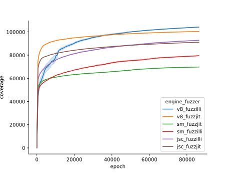

# Artifact Evaluation - FuzzJIT
This repository contains the Docker setup and experiment configurations we use to reproduce the claims from [FuzzJIT (paper)](https://www.usenix.org/system/files/sec23summer_118-wang_junjie-prepub.pdf). The first part of this README will show our results, and the second part will guide through the setup of our environment so that you can reproduce our results.

## Conducted Experiments
The FuzzJIT paper uses as targets (among others) *v8*, *jsc*, and *spidermonkey*. On all of these three engines, the authors report a significant increase in code coverage as well as improving the *semantic correctness rate*. The latter metric quantifies how many of the generated .js inputs execute successfully, as opposed to prematurely terminate due to an error in the .js code. We attempted to reproduce the two major claims of the paper.

### Code Coverage
We attempted to reproduce the improvements in code coverage. For this experiment, we run both FuzzJIT and Fuzzilli for 24h with 10 repetitions each. The branch coverage of the resulting corpora is evaluated with lcov. 
#### The Coverage plot:


In contrast to the authors, we cannot report an improvement in branch coverage.


### Semantic Correctness Rate

The results from `results/correctness.json` show a result quite different from what has been reported by the authors. We cannot reproduce any improvement in the semantic correctness rate.

| Engine       | Fuzzilli Reported  | FuzzJIT Reported  | Fuzzilli Measured | FuzzJIT Measured |
| ------------ |------------------- | ----------------- | ----------------- | ---------------- |
| JSC          | 62.80%             | 90.33%            | 66.56%            | 65.88%           |
| V8           | 64.34%             | 97.04%            | 66.74%            | 63.67%           |
| SpiderMonkey | 64.13%             | 93.28%            | 67.47%            | 63.93%           |


## Setup
To reproduce our evaluation, follow these steps:

1. Clone this repository

   ```git clone git@github.com:fuzz-evaluator/fuzzjit-eval.git```

2. Execute the `run.sh` script

   **Important Note:** Running the script will first build the docker container consuming roughtly 50GB of storage and subsequenctly spawn 60 containers. Each of these containers will be bound to a specific CPU (0-59) and run for 24h. If your machine has less than 60 cores available, the script needs to be adapted.

The final results will be stored in `./results/
